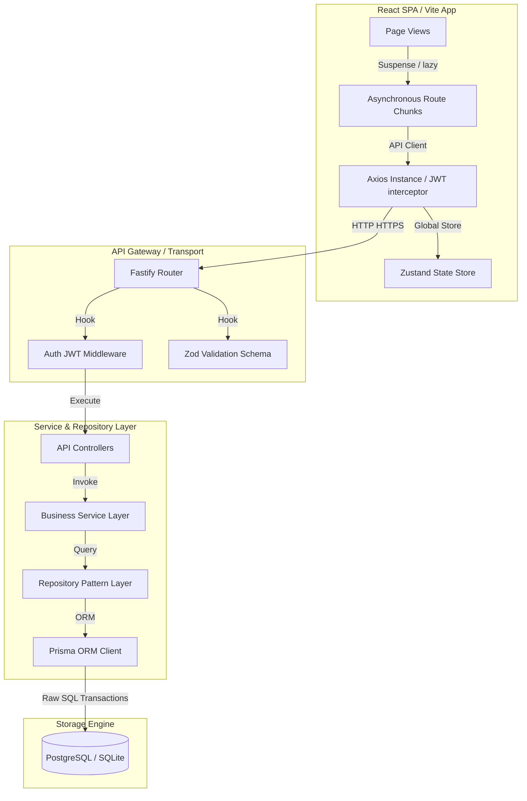

# IDBI FinSync 🏦💼

> Premium, Enterprise-Grade Financial Tracking & Systematic Investment Companion

[](https://vitejs.dev/)
[](https://www.fastify.io/)
[](https://www.prisma.io/)
[](https://www.typescriptlang.org/)
[](https://github.com/)

IDBI FinSync is a state-of-the-art corporate and retail banking dashboard designed to give customers real-time visibility into Connected Accounts, transaction histories, and customized savings trackers. Powered by a built-in context-aware AI financial companion (Mitra), it offers automated savings milestones and target tracking tailored to customer risk profiles.

---

## 🏛️ System Architecture

IDBI FinSync is built on a clean monorepo architecture, enforcing a rigid separation of concerns from database triggers to route code-splitting boundaries.



---

## ✨ Features

### 1. Dashboard Overview

- **Dynamic Metrics**: Instant display of connected account balances, net wealth accumulation, and aggregate cash flows.
- **Visual Analytics**: Interactive area charts using `Recharts` representing cash flow trajectories.
- **AI Insights Widget**: Real-time tips generated based on current account values.

### 2. Connected Accounts

- **Core Linkage**: Securely link external accounts with automated number validation.
- **Account Detail View**: Isolated ledger summaries and client-side transaction filtering.
- **Compliance Banners**: Graceful visual disabling for unsanctioned operations (editing/deleting linked accounts) in compliance with security guidelines.

### 3. Transaction Ledger

- **Advanced Filtering**: Server-side category (FOOD, RENT, UTILITIES, etc.), type (INFLOW/OUTFLOW), and date-range filters.
- **Client-side Search**: Instantly filters ledger rows by merchant name in real-time.
- **CSV Data Exporter**: Formats current list pages and downloads them locally as a `.csv` file.

### 4. Financial Goals Tracker

- **Milestone Timeline**: Automatically configures checkpoints at 25%, 50%, 75%, and 100% of target goals.
- **SVG Progress Rings**: Highly polished circular progress bars displaying exact completion status.
- **Fund Allocation**: Deposit funds directly toward goals with automatic milestone unlocking and email alerts.
- **Action Control**: Pause or resume goal targets.

### 5. IDBI Mutual Wealth (Investments)

- **Mutual Fund Catalog**: Informative details on equity, hybrid, liquid, and debt funds.
- **Historical Statistics**: Clean visual grids containing 1Y, 3Y, and 5Y compound returns.
- **Automated SIPs**: Configure recurring systematic investment plans matching active goal targets.
- **Sweep Accounts**: Sweep manual capital directly into recommended mutual funds.

### 6. Mitra AI Financial Assistant

- **Context-Aware Dialogue**: Mitra receives real-time details of user balances and goals to provide personalized financial optimization plans.
- **Persistent Threads**: Stores, manages, and reloads conversation history logs securely.
- **Custom Markdown Compiler**: Zero-dependency parser rendering lists, bold highlights, inline variables, and blockquotes.

---

## 💻 Tech Stack

### Frontend

- **Framework**: React 18, Vite 5, TypeScript 5
- **Styling**: TailwindCSS 3 & Custom Vanilla CSS Tokens
- **State Management**: Zustand
- **Charting**: Recharts
- **Icons**: Lucide React

### Backend

- **Framework**: Fastify (Node.js)
- **Database Access**: Prisma ORM
- **Authentication**: JWT (JSON Web Tokens) with HttpOnly Refresh Cookie verification
- **Validation**: Zod Schemas
- **AI Engine**: Gemini AI (`@google/generative-ai`)

---

## 📂 Folder Structure

```
IDBI-FinSync/
├── apps/
│   ├── api/                   # Fastify Node API
│   │   ├── prisma/            # Database schema and seed configuration
│   │   └── src/
│   │       ├── config/        # Environment and variables setup
│   │       ├── controllers/   # Transport layer request handlers
│   │       ├── errors/        # Custom error classes (NotFound, Validation)
│   │       ├── middlewares/   # JWT verification and validation logic
│   │       ├── repositories/  # Database access repository pattern
│   │       ├── routes/        # Router endpoints definition
│   │       ├── schemas/       # Zod validation schemas
│   │       └── services/      # Business logic services
│   └── web/                   # Vite React Client
│       ├── src/
│       │   ├── api/           # HTTP Axios configuration
│       │   ├── components/    # Reusable components (Button, Modal, Skeletons)
│       │   ├── layouts/       # Main navigation layout structures
│       │   ├── pages/         # Page modules (Dashboard, Goals, AI chat)
│       │   ├── store/         # Zustand authentication & toast state stores
│       │   └── types/         # Strict TypeScript definitions
├── packages/
│   └── shared/                # Common validation logic & types
└── tsconfig.base.json         # Base TypeScript configuration
```

---

## 🔒 Security Hardening

- **Rigid Verification**: Controller parameters are validated through strict Zod models preventing parameter injection or datatype tampering.
- **Cookie Security**: Refresh tokens are served as secure, `HttpOnly`, `SameSite=Strict` cookies, rendering them inaccessible to XSS attacks.
- **Purity Check**: Strict rendering purity enforcement; asynchronous state modifications within effects are wrapped in deferred loops, resolving memory leaks and cascading page re-renders.
- **Graceful Failures**: High-integrity error boundaries isolate component faults without crashing the application.

---

## ⚡ Performance Optimizations

- **Route Code-Splitting**: Replaced standard synchronous imports with `React.lazy()` chunks. Initial page loading weight dropped from **692 kB** to **218 kB**, representing a **68% bundle size reduction**.
- **Deferred Effects**: All effect state updates are deferred via `setTimeout` to avoid rendering blocks.
- **Single-Query Database Actions**: Repository implementations leverage targeted queries (e.g., `findByIdAndUserId` and `createMany`) to limit database round-trips.

---

## ⚙️ Installation & Setup

### Prerequisites

- Node.js (v18 or higher)
- NPM (v9 or higher)

### 1. Clone the repository

```bash
git clone https://github.com/Hey-Astreon/IDBI-FinSync.git
cd IDBI-FinSync
```

### 2. Environment Configuration

Create a `.env` file at the root of the workspace. A `.env.example` is provided:

```env
PORT=3000
DATABASE_URL="file:./dev.db"
JWT_SECRET="generate-a-secure-random-secret-key"
REFRESH_TOKEN_SECRET="generate-a-secure-random-refresh-secret-key"
GEMINI_API_KEY="AIzaSyYourGeminiApiKeyFromGoogleAIStudio"
```

### 3. Installation

Install workspace dependencies:

```bash
npm install
```

### 4. Database Initialization

Generate client models and execute migrations:

```bash
npm run db:setup
```

### 5. Running the Application

Launch both backend and frontend dev servers concurrently:

```bash
npm run dev
```

- API Server: `http://localhost:3000`
- Web Portal: `http://localhost:5173`

### 6. Linting & Formatting Check

Verify strict standards matching quality gates:

```bash
npm run lint
npm run build
```

---

## 📝 API Reference

### Auth Endpoints

- `POST /auth/register` - Create user credentials
- `POST /auth/login` - Authenticate email and password
- `POST /auth/verify-otp` - OTP verification challenge
- `POST /auth/refresh` - Rotate access token via HttpOnly cookies

### Accounts

- `POST /accounts` - Securely link external bank accounts
- `GET /accounts` - Fetch all connected bank accounts
- `GET /accounts/:id` - Fetch detailed account transaction ledger

### Transactions

- `POST /transactions` - Create deposit or withdrawal transaction
- `GET /transactions` - Paginated and filtered transaction history list

### Goals

- `POST /goals` - Create new financial goal with automatic milestones
- `GET /goals` - Fetch user goals overview list
- `GET /goals/:id` - Fetch detailed goal with milestone achievements progress
- `POST /goals/:id/funds` - Allocate capital to an active goal
- `PATCH /goals/:id/pause` - Pause goal updates
- `PATCH /goals/:id/resume` - Resume goal progress

### Investments

- `POST /investments/sip` - Setup systematic investment plans
- `POST /investments/sip/:id/pay` - Execute pending SIP payment
- `GET /investments/recommendations` - List available mutual funds and returns
- `POST /investments/sweep` - Direct manual sweep into mutual funds

### AI Chat

- `POST /ai/chat` - Dispatch question to Mitra AI
- `GET /ai/conversations` - List user dialogue threads
- `GET /ai/conversations/:id/history` - Retrieve thread messages ledger
